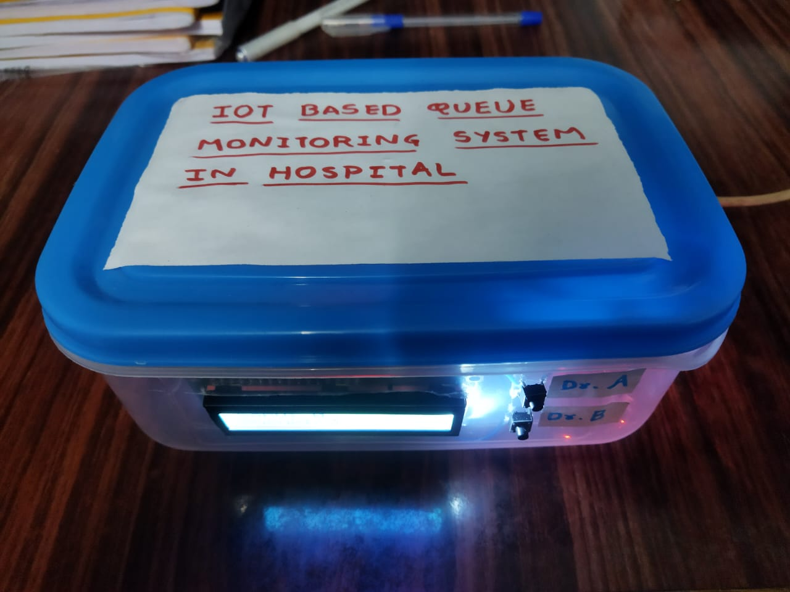
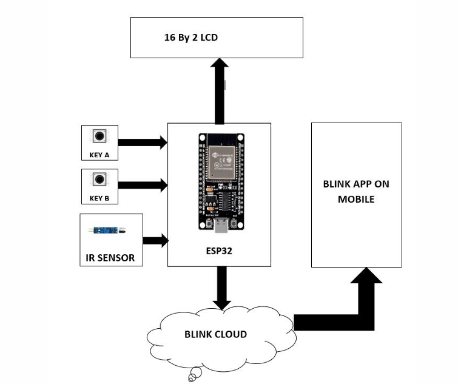

# 🏥 IoT Based Hospital Queue Monitoring and Patient Notification System



<h3 align="center">Smart IoT-Based Patient Queue Monitoring and Notification System</h3>

<p align="center">
  An IoT-based smart hospital queue management system using ESP32, ultrasonic sensor, LCD, Blynk IoT and GSM notification.
</p>

---

## 📌 Project Overview

The **IoT Based Hospital Queue Monitoring and Patient Notification System** is designed to simplify and digitalize the hospital appointment and queue management process.

The system uses an **ESP32 microcontroller, ultrasonic sensor, keypad, LCD display, Blynk IoT platform, and GSM module** to automatically monitor the patient queue, assign patients to doctors, display real-time queue information, and notify patients when their turn arrives.

The system follows a **First-Come-First-Serve (FCFS)** approach and helps reduce waiting-time confusion, minimize crowding, and improve communication between hospital staff and patients.

---

## 🎯 Aim

To design and implement an IoT-based system for automated hospital queue monitoring and patient notification, enabling efficient patient-flow management and real-time communication.

---

## 🎯 Objectives

- Automatically detect and count patients using an ultrasonic sensor.
- Maintain a single centralized patient queue.
- Assign patients to Doctor A or Doctor B using a keypad.
- Display the current serving number and assigned doctor on the LCD.
- Provide real-time queue information through Blynk IoT.
- Notify patients through GSM when their turn arrives.
- Reduce manual queue management and improve hospital workflow.

---

## ⭐ Features

- Automatic patient detection and counting
- First-Come-First-Serve (FCFS) queue management
- Single centralized patient queue
- Doctor A / Doctor B assignment
- Real-time LCD display
- Blynk IoT-based remote monitoring
- GSM SMS/call notification
- Absent patient handling
- Real-time synchronization
- Scalable design for multiple doctors and departments

---

## 🧰 Hardware Requirements

| Component | Purpose |
|---|---|
| ESP32 Microcontroller | Main processing and communication unit |
| Ultrasonic Sensor | Patient detection and counting |
| 16×2 LCD with I2C | Queue and doctor information |
| Two-Button Keypad | Doctor A / Doctor B selection |
| GSM Module | Patient SMS/call notification |
| 5V DC Power Supply | Power supply |
| Connecting Wires | Circuit connections |
| Breadboard / PCB | Hardware assembly |

---

## 💻 Software Requirements

- Arduino IDE
- Blynk IoT Platform
- ESP32 Board Package
- Required Arduino libraries for ESP32, LCD, Blynk and GSM

---

## ⚙️ Working Principle

When a patient enters the waiting area, the **ultrasonic sensor** detects the patient and sends the information to the ESP32. The ESP32 updates the queue count.

The queue information is displayed on the LCD and synchronized with the Blynk IoT application through Wi-Fi.

The receptionist can assign the patient to **Doctor A or Doctor B** using the keypad. The ESP32 updates the current serving number and assigned doctor.

When the patient's turn arrives, the GSM module can send an SMS or make a call to notify the patient.

After the patient is served, the queue is updated and the next patient is served according to the **FCFS** principle.

---

## 🔄 System Flow

Patient Entry  
↓  
Ultrasonic Sensor Detection  
↓  
ESP32 Microcontroller  
↓  
Queue Count Update  
↓  
Doctor Selection  
↓  
LCD Display + Blynk IoT  
↓  
GSM SMS/Call Notification  
↓  
Patient Served  
↓  
Next Patient

---

## 🧱 Block Diagram



---

## 🔌 Hardware Connections

| Component | ESP32 Pin | Function |
|---|---|---|
| Sensor OUT | GPIO 18 | Patient detection |
| LCD SDA | GPIO 21 | I2C Data |
| LCD SCL | GPIO 22 | I2C Clock |
| Button A | GPIO 25 | Doctor A selection |
| Button B | GPIO 26 | Doctor B selection |
| Power Supply | 5V, GND | Power |

---

## 📱 Blynk IoT Monitoring

The **Blynk IoT platform** is used for real-time mobile monitoring.

The ESP32 sends queue information to Blynk through Wi-Fi.

The application can display:

- Current queue count
- Current "Now Serving" number
- Assigned doctor
- Queue status

### Blynk Virtual Pins

| Virtual Pin | Information |
|---|---|
| V1 | Queue Count |
| V2 | Now Serving Number |
| V3 | Doctor Assigned |

---

## 📸 Project Images

### Hardware Prototype

<p align="center">
  
</p>

### Block Diagram


### LCD Output


### Blynk IoT Dashboard


---

## 💻 Source Code

The complete ESP32 Arduino source code is available in this repository.

**Source Code:** [Hospital_Queue_System.ino](./Hospital_Queue_System.ino)

The program handles:

- Patient detection
- Queue counting
- Queue management
- Doctor selection
- LCD display
- Blynk IoT communication
- GSM notification
- Absent patient handling
- Queue updates

---

## 📊 Results

The developed system was tested for patient detection, queue management, doctor selection, LCD display, Blynk monitoring, GSM notification, and absent-patient handling.

| Parameter | Observation |
|---|---|
| Patient Detection | Patient entry detected within the tested range |
| Queue Count | Real-time and consistent |
| Doctor Selection | Correctly assigned patients |
| LCD Display | Real-time "Now Serving" information |
| Blynk App | Real-time queue updates |
| GSM Notification | Patient notification |
| Absent Patient | Skip function handled |

---

## 💡 Advantages

- Reduces manual queue management.
- Reduces waiting-time confusion.
- Helps minimize unnecessary crowding.
- Provides real-time queue information.
- Allows dynamic doctor assignment.
- Provides remote queue monitoring.
- Provides GSM-based patient notifications.
- Reduces manual errors.
- Maintains FCFS queue order.
- Can be expanded for multiple doctors and departments.
- Provides a low-cost IoT-based solution.

---

## ⚠️ Limitations

- Sensor detection may be affected if multiple people pass the detection area simultaneously.
- Proper sensor placement and calibration are important.
- GSM notifications depend on network availability.
- Internet connectivity is required for Blynk monitoring.
- The current prototype has limited doctor-selection inputs.
- Continuous operation requires a stable power supply.

---

## 🏥 Applications

### Hospital and Clinic Queue Management

- Patient flow management
- Waiting-time reduction
- Real-time queue updates

### Multi-Doctor Management

- Dynamic doctor assignment
- Centralized queue management
- Reduced manual errors

### Public Service Centers

The concept can be adapted for:

- Banks
- Government offices
- Customer service counters

### Smart Hospitals

The system can be integrated with hospital management software and historical queue data analysis.

### Events and Conferences

The system can be adapted for visitor queue management.

### Educational Institutions

The concept can be used for laboratories, libraries and other student services.

---

## 🚀 Future Scope

The project can be further enhanced with:

- RFID-based patient identification
- QR-code based patient check-in
- Predictive waiting-time estimation
- Multiple department support
- Centralized cloud management
- Enhanced mobile application
- Online appointment booking
- Automated patient marking
- Historical queue data analysis
- Multiple ESP32 units for larger hospitals
- Integration with hospital management software

---

## 📁 Project Structure

```text
ESP32-Hospital-Queue-Monitoring/
│
├── README.md
├── Hospital_Queue_System.ino
│
└── Images/
    ├── Block_Diagram.png
    ├── Blynk_Screenshot.jpeg
    ├── LCD_Output.jpeg
    └── Project_Model.jpeg
```

---

## 👨‍💻 Team Members

1. **Digvijay Dipak Chavan**
2. **Vishwajeet Jagdish Ghorpade**
3. **Aditya Mukund Kumbhar**

---

## 👨‍🏫 Project Guide

**Prof. Snehal R. Watharkar**

Department of Electronics and Telecommunication Engineering

---

## 🏫 Institute

**K. E. Society's Rajarambapu Institute of Technology, Rajaramnagar**

**Department:** Electronics and Telecommunication Engineering

**Academic Year:** 2025–2026

---

## 🙏 Acknowledgement

We sincerely thank our Project Supervisor **Prof. Snehal R. Watharkar**, Department of Electronics and Telecommunication Engineering, for valuable guidance, assistance, timely suggestions, and continuous support throughout the development of this project.

We also thank the Head of the Department, technical and supporting staff, and faculty members for their valuable support and encouragement.

---

## 📜 Conclusion

The **IoT Based Hospital Queue Monitoring and Patient Notification System** demonstrates a smart, efficient, and practical approach to hospital queue management.

The integration of the **ESP32, ultrasonic sensor, LCD, keypad, Blynk IoT platform, and GSM module** provides an effective solution for patient counting, queue management, doctor assignment, real-time monitoring, and patient notification.

The project provides a foundation for further development toward smart hospital automation with RFID/QR check-in, predictive waiting-time analysis, centralized cloud management, and enhanced mobile applications.

---

## 🔖 Project Information

**Project Title:** IoT Based Hospital Queue Monitoring and Patient Notification System

**Domain:** Internet of Things (IoT)

**Controller:** ESP32

**Sensor:** Ultrasonic Sensor

**Communication:** Wi-Fi and GSM

**IoT Platform:** Blynk

**Display:** 16×2 LCD with I2C

**Queue Algorithm:** First-Come-First-Serve (FCFS)

**Application Area:** Healthcare and Hospital Automation

**Academic Year:** 2025–2026
