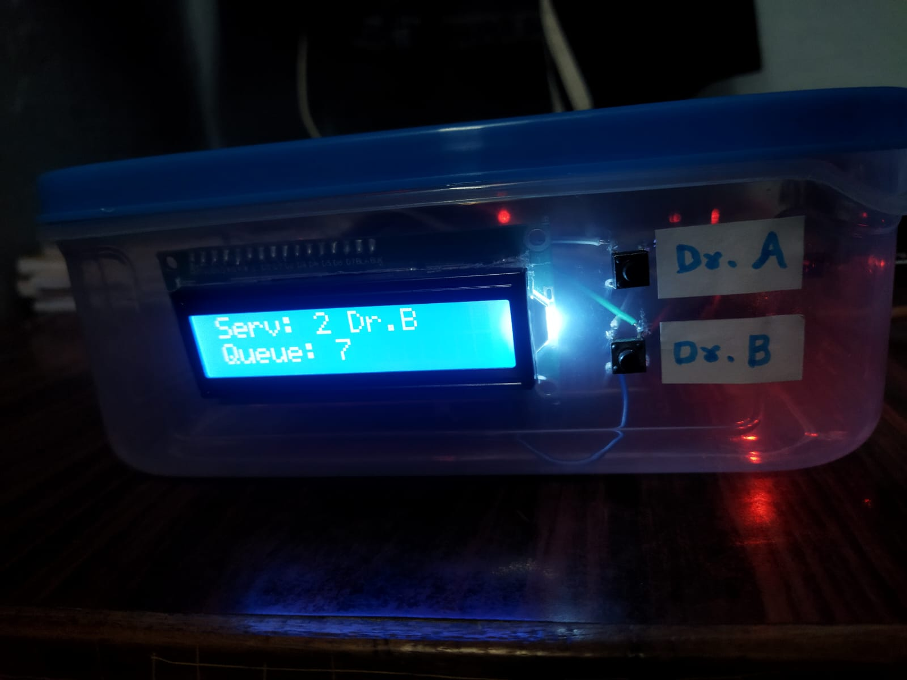
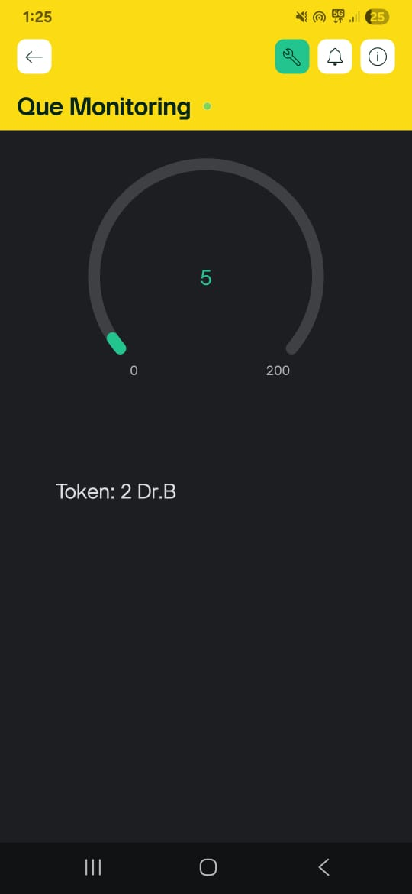

# 🏥 IoT Based Hospital Queue Monitoring System

  

## 📌 Project Overview

The **IoT Based Hospital Queue Monitoring System** is a smart healthcare system designed to automate and simplify patient queue management in hospitals and clinics.

The system uses an **ESP32 microcontroller, HC-SR04 Ultrasonic Sensor, 16×2 LCD, push buttons, GSM module, and Blynk IoT platform** to monitor the patient queue and provide real-time updates.

---

## 🎯 Objectives

- Automatically detect and count patients.
- Maintain the patient queue.
- Assign patients to Doctor A or Doctor B.
- Display queue information on an LCD.
- Monitor the queue remotely using Blynk IoT.
- Notify patients using GSM.

---

## ⭐ Features

- Automatic patient detection
- Real-time queue monitoring
- Doctor assignment
- LCD queue display
- Blynk IoT monitoring
- GSM notification
- First-Come-First-Serve (FCFS) queue management

---

## 🧰 Hardware Used

- ESP32
- HC-SR04 Ultrasonic Sensor
- 16×2 LCD with I2C
- Push Buttons
- GSM Module
- 5V Power Supply

---

## 💻 Software Used

- Arduino IDE
- Blynk IoT Platform
- ESP32 Board Package

---

## ⚙️ Working Principle

The **HC-SR04 ultrasonic sensor** detects a patient entering the waiting area and sends the information to the ESP32.

The ESP32 processes the patient information and manages the queue. The queue information is displayed on the LCD and updated on the Blynk IoT platform.

The receptionist can assign patients to **Doctor A or Doctor B**, and the GSM module can be used to notify patients when their turn arrives.

### System Flow

Patient Entry  
↓  
HC-SR04 Ultrasonic Sensor  
↓  
ESP32 Microcontroller  
↓  
Queue Management  
↓  
LCD + Blynk IoT + GSM Notification

---

## 🧱 Block Diagram

  

---

## 📸 Project Images

### 🔹 Hardware Prototype

  

### 🔹 LCD Output

  

### 🔹 Blynk Dashboard

  

---

## 📊 Results

The system was tested for patient detection, queue management, doctor selection, LCD display, Blynk monitoring, and GSM notification.

The project achieved approximately **95–98% patient detection accuracy** during testing.

---

## 🚀 Future Scope

- RFID-based patient identification
- QR-code based check-in
- AI-based waiting-time prediction
- Online appointment system
- Multiple doctor and department support

---

## 🏥 Applications

- Hospitals
- Clinics
- Healthcare centers
- Multi-doctor consultation centers
- Public service centers

---

## 👨‍💻 Team Members

- **Digvijay Dipak Chavan**
- **Vishwajeet Jagdish Ghorpade**
- **Aditya Mukund Kumbhar**

**Project Guide:** Prof. Snehal R. Watharkar

**Institute:** K. E. Society's Rajarambapu Institute of Technology, Rajaramnagar

**Academic Year:** 2025–2026
